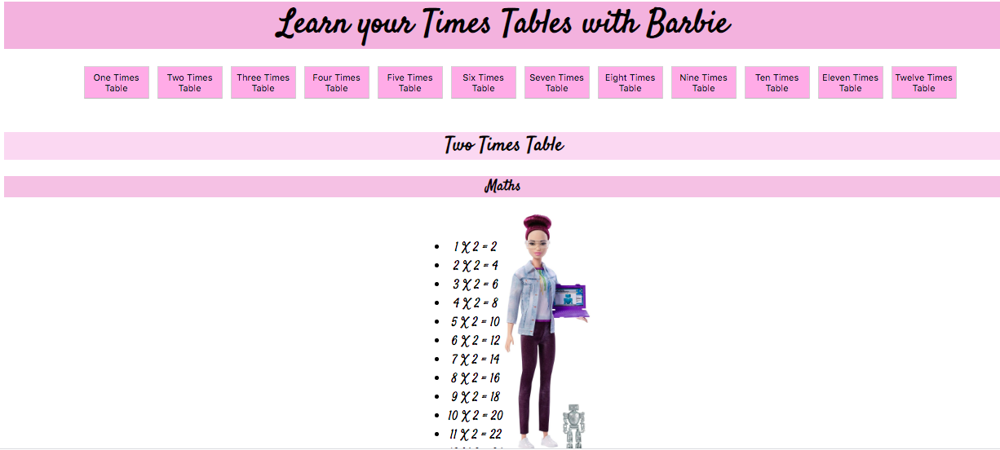
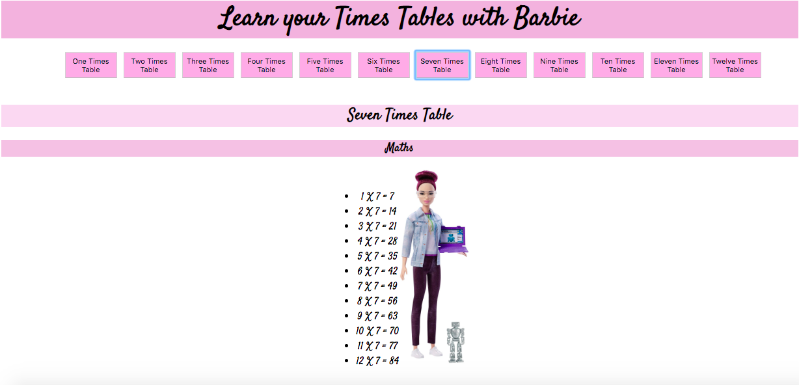
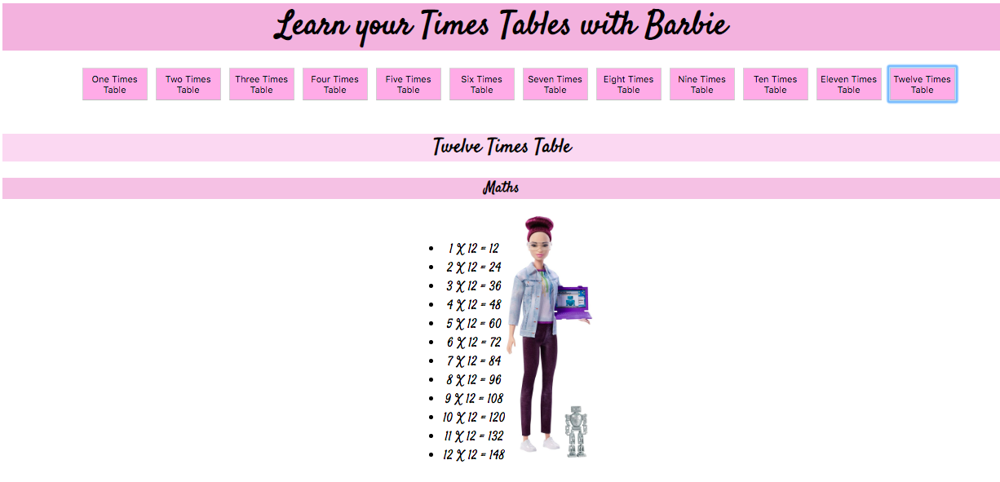

#  Learn your Times Tables with Barbie

* Click a button to choose a times table to learn


### How to use:

**Clone this repository:**

```html
git clone https://github.com/emilyjspencer/Times-Tables.git
```

**cd into the repo on your computer**

Run:
```html
npm install
```

**Start the server:**

```html
npm start
```

**Go to: **
```html
localhost:3000
```


## Built with

* React
* HTML/CSS


### What it looks like:




